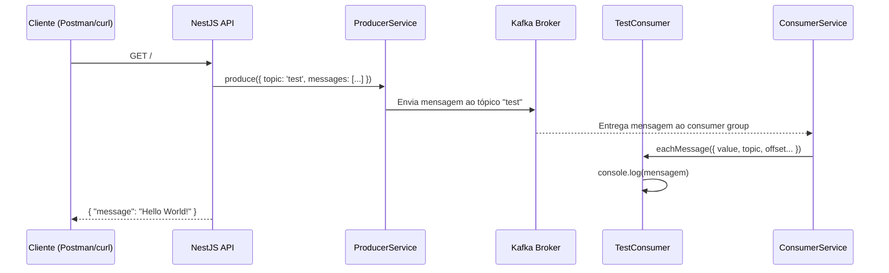

<p align="center">
  <a href="https://nestjs.com/" target="_blank">
    
  </a>
  &nbsp;&nbsp;&nbsp;
  <a href="https://kafka.apache.org/" target="_blank">
    
  </a>
</p>

<h1 align="center">🚀 Integração de Apache Kafka com NestJS</h1>

<p align="center">
  Aplicação de referência para arquiteturas orientadas a eventos com <strong>NestJS</strong> e <strong>KafkaJS</strong>.
</p>

<p align="center">
  
  
  
  
</p>

---

## Sobre o projeto

Recentemente desenvolvi esta aplicação utilizando **NestJS** e **KafkaJS** para explorar a implementação de arquiteturas orientadas a eventos e comunicação assíncrona entre serviços.

O objetivo é demonstrar, na prática, como produtores e consumidores podem se comunicar através de um broker Kafka — com gerenciamento correto do ciclo de vida das conexões, desacoplamento entre componentes e processamento de mensagens em tempo real.

Além da implementação técnica, o projeto permitiu aprofundar conhecimentos sobre **sistemas distribuídos**, **mensageria**, **processamento assíncrono** e padrões utilizados em arquiteturas modernas de microsserviços.

---

## O que foi desenvolvido

- Estruturação de **Producers** e **Consumers** utilizando KafkaJS
- Gerenciamento do ciclo de vida das conexões com Kafka através dos **hooks do NestJS** (`OnModuleInit`, `OnApplicationShutdown`)
- Produção de mensagens para tópicos Kafka
- Consumo e processamento de mensagens em tempo real
- Gerenciamento de **múltiplos consumidores** para diferentes tópicos
- Tratamento adequado de conexão e desconexão dos serviços durante **startup** e **shutdown** da aplicação
- Ambiente local com **Docker Compose** (broker Kafka-compatível + API containerizada)

---

## Como a aplicação funciona

### Fluxo completo



### Passo a passo

1. **Startup da aplicação**
   - O `ProducerService` conecta ao broker Kafka no hook `onModuleInit`
   - O `TestConsumer` se inscreve no tópico `test` e inicia o processamento de mensagens

2. **Requisição HTTP**
   - Um `GET /` aciona o `AppController` → `AppService`
   - O `AppService` publica uma mensagem `"Hello World!"` no tópico `test` via `ProducerService`

3. **Consumo em tempo real**
   - O `ConsumerService` recebe a mensagem do broker
   - O `TestConsumer` processa o evento e exibe no console: valor, tópico, partição, offset e timestamp

4. **Shutdown da aplicação**
   - No encerramento, os hooks `onApplicationShutdown` desconectam producer e consumers de forma segura

### Exemplo de saída no console

```json
{
  "value": "Hello World!",
  "topic": "test",
  "partition": 0,
  "offset": "0",
  "timestamp": "1780688713261"
}
```

---

## Arquitetura implementada

```
┌─────────────────┐       HTTP        ┌──────────────────┐
│  Cliente        │ ────────────────► │  NestJS API      │
│  (Postman/curl) │                   │  (porta 3000)    │
└─────────────────┘                   └────────┬─────────┘
                                             │
                                    ┌────────▼─────────┐
                                    │  ProducerService │ ──► publica eventos
                                    └────────┬─────────┘
                                             │
                                    ┌────────▼─────────┐
                                    │  Kafka Broker    │ ◄── tópico: "test"
                                    │  (porta 9092)    │
                                    └────────┬─────────┘
                                             │
                                    ┌────────▼─────────┐
                                    │  ConsumerService │ ◄── consumer group: "nestjs-kafka"
                                    └────────┬─────────┘
                                             │
                                    ┌────────▼─────────┐
                                    │  TestConsumer    │ ──► processa mensagens
                                    └──────────────────┘
```

### Componentes

| Componente | Responsabilidade |
|---|---|
| `ProducerService` | Conecta ao broker e envia eventos para tópicos Kafka |
| `ConsumerService` | Gerencia inscrições, execução e desconexão de múltiplos consumers |
| `TestConsumer` | Consumer de exemplo inscrito no tópico `test` |
| `AppService` | Orquestra a produção de mensagens a partir da rota HTTP |
| `KafkaModule` | Módulo NestJS que encapsula e exporta os serviços Kafka |

### Princípios aplicados

- **Producer Service** responsável pelo envio de eventos para o broker Kafka
- **Consumer Service** responsável pela inscrição e processamento das mensagens recebidas
- Serviços **desacoplados** através de comunicação assíncrona baseada em eventos
- Organização **modular** seguindo boas práticas do ecossistema NestJS

---

## Estrutura do projeto

```
src/
├── app.controller.ts      # Rota GET /
├── app.service.ts         # Publica mensagem no tópico "test"
├── app.module.ts          # Módulo raiz da aplicação
├── test.consumer.ts       # Consumer de exemplo (tópico "test")
├── main.ts                # Bootstrap da aplicação
└── kafka/
    ├── kafka.module.ts    # Módulo Kafka (DI)
    ├── kafka.config.ts    # Configuração do broker (env)
    ├── producer.service.ts
    └── consumer.service.ts
```

---

## Tecnologias utilizadas

| Tecnologia | Uso no projeto |
|---|---|
| [NestJS](https://nestjs.com/) | Framework backend, injeção de dependência e lifecycle hooks |
| [TypeScript](https://www.typescriptlang.org/) | Tipagem estática e segurança no desenvolvimento |
| [KafkaJS](https://kafka.js.org/) | Cliente Node.js para produção e consumo de mensagens |
| [Apache Kafka](https://kafka.apache.org/) | Protocolo de mensageria e arquitetura orientada a eventos |
| [Redpanda](https://redpanda.com/) | Broker Kafka-compatível para ambiente local (sem Zookeeper) |
| [Docker Compose](https://docs.docker.com/compose/) | Orquestração do broker e da API |
| Postman / curl | Teste da rota HTTP e validação do fluxo |

> **Nota:** O broker local utiliza **Redpanda**, totalmente compatível com o protocolo Kafka e mais simples de subir em desenvolvimento (modo KRaft, sem necessidade de Zookeeper).

---

## Pré-requisitos

- [Node.js](https://nodejs.org/) 20+
- [pnpm](https://pnpm.io/)
- [Docker](https://www.docker.com/) e Docker Compose

---

## Como executar

### 1. Instalar dependências

```bash
pnpm install
```

### 2. Subir o broker Kafka

```bash
pnpm kafka:up
```

Isso sobe o Redpanda na porta `9092`.

### 3. Iniciar a API

```bash
# desenvolvimento
pnpm start:dev

# ou produção
pnpm start
```

A API ficará disponível em `http://localhost:3000`.

### 4. Testar o fluxo

```bash
curl http://localhost:3000
```

**Resposta esperada:**

```json
{ "message": "Hello World!" }
```

No terminal da aplicação, você verá o log da mensagem consumida do tópico `test`.

### 5. Parar os serviços

```bash
pnpm kafka:down
```

---

## Executar tudo com Docker

Para subir broker + API em containers:

```bash
docker compose up -d
```

| Serviço | Porta | Descrição |
|---|---|---|
| `kafka` | 9092 | Broker Kafka-compatível (Redpanda) |
| `api` | 3000 | API NestJS |

---

## Variáveis de ambiente

Copie o arquivo de exemplo:

```bash
cp .env.example .env
```

| Variável | Padrão | Descrição |
|---|---|---|
| `KAFKA_BROKERS` | `localhost:9092` | Endereço do broker (use `kafka:29092` dentro do Docker) |
| `PORT` | `3000` | Porta da API NestJS |

---

## Scripts disponíveis

```bash
pnpm start          # Inicia a aplicação
pnpm start:dev      # Modo watch (desenvolvimento)
pnpm start:prod     # Executa build de produção
pnpm kafka:up       # Sobe apenas o broker Kafka
pnpm kafka:down     # Para os containers Docker
pnpm test           # Testes unitários
pnpm test:e2e       # Testes end-to-end
```

---

## Por que esse projeto importa?

Projetos como esse ajudam a compreender na prática como grandes aplicações lidam com:

- **Alta escalabilidade** — processamento distribuído de eventos
- **Desacoplamento entre serviços** — comunicação via mensagens, não chamadas diretas
- **Processamento em tempo real** — consumers reagem a eventos assim que chegam ao broker
- **Resiliência** — gerenciamento correto de conexões no ciclo de vida da aplicação

---

## Autor

**Felipe FSA** — [GitHub](https://github.com/Felipefsa03)

---

<p align="center">
  <strong>#NestJS #Kafka #KafkaJS #TypeScript #Backend #SoftwareEngineering #Microservices #EventDrivenArchitecture #ApacheKafka #NodeJS #DevOps #DesenvolvimentoDeSoftware</strong>
</p>
